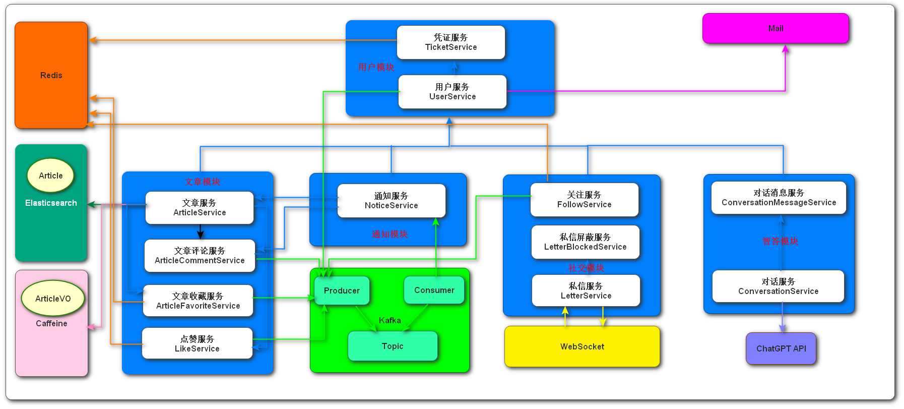
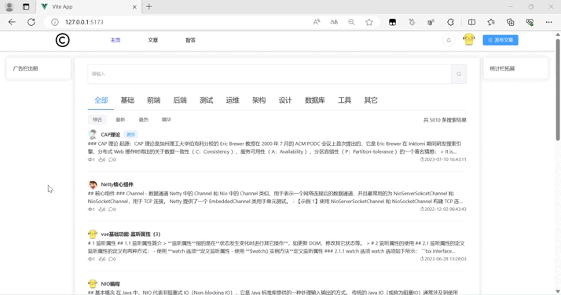
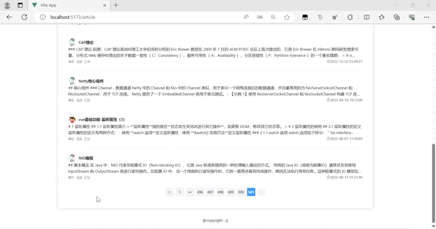
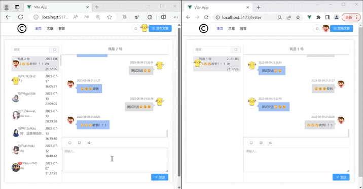
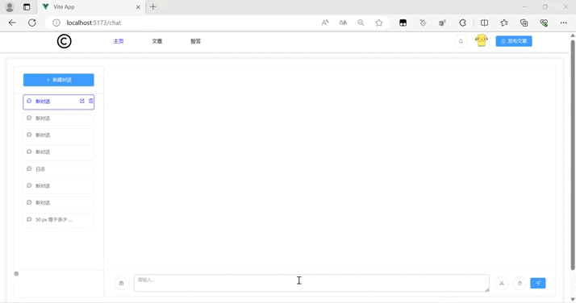

# coder-go
CoderGo 是一个基于 Vue3 + SpringBoot3 进行搭建的开源技术交流社区项目。
## 功能模块图
一个简单的功能模块图，线条描述了业务功能之间的依赖关系

## 部分界面运行效果
### 文章模块-（分类、分页、排序、搜索）
两个侧边栏可以进行自定义拓展

### 文章模块-（评论、点赞、收藏）

### 社交模块-（私信聊天）

### 智答模块-（gpt对话相关）
核心秘籍（APIKey、Proxy）

其它的旮旯不展示了
